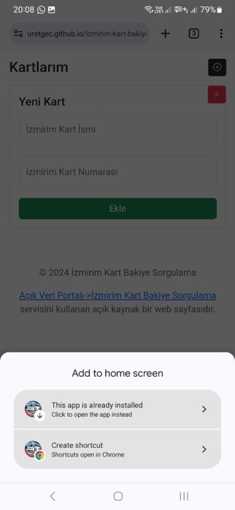
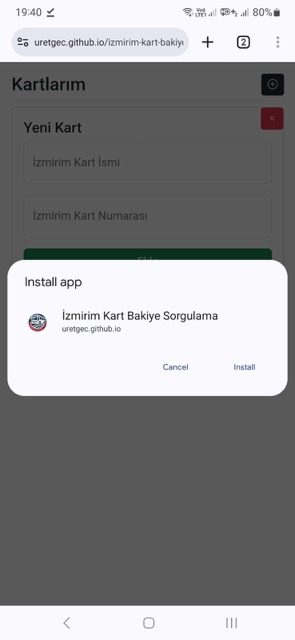
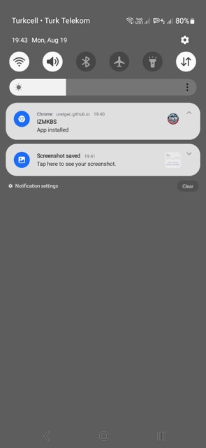
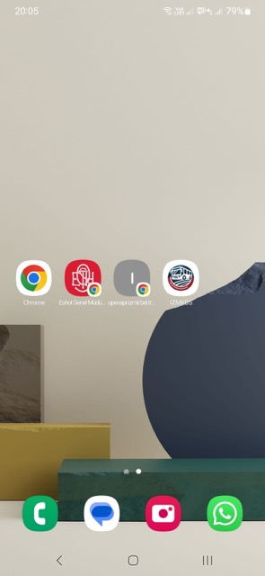
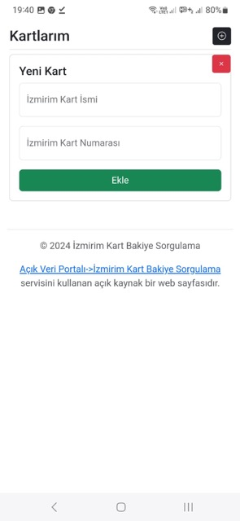
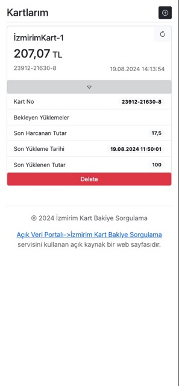

# İZMİRİM KART BAKİYEM #

<p align="center"></p>

İzmirim Kart bakiye sorgulama ekranı. İzmir Büyükşehir Belediyesinin "Açık Veri Portalı" içinde yer alan "İzmirim Kart Bakiye Sorgulama" servisini kullanarak kartlarınızın bakiyesini kontrol edebilirsiniz.

## PWA Mobil Kurulum ##








## Özellikler ##

- [Açık Veri Portalı->İzmirim Kart Bakiye Sorgulama](https://acikveri.bizizmir.com/tr/dataset/izmirim-kart-bakiye-sorgulama/resource/4f6b8d92-bf86-4707-98d4-6f1b29758062) adresindeki açık api kullanılmakta.
- Dilediğiniz kadar kartı ekleyip bakiye sorgusu yapabilirsiniz. (Sayfalama sistemi yok ne yazik ki)
- Tarayıcı üzerinde çalışır ve localstorage özelliğini kullanır. (Veriler açtığınız tarayıcı üzerinde kalır. )
- Kartlarınız son güncelleme tarihine göre listelenir.
- Api tarafından verilen tüm bilgiler görüntülenir.
- Kart sıralaması: en güncel kart en üstte listelenir.
- Websitesi Github Pages tarafından servis edilir.
- PWA özelliği vardır. Bilgisayarında veya mobil cihazında "Add To Home Screen" özelliğini kullanarak uygulama olarak kullanıbilirsin.

### Eksikler ###

- [X] Localstorage entegresi
- [X] Yeni kart ekle butonu kart eklenene kadar disable olmalı
- [X] Kartlarım sıralaması (sıralama lat update time a göre yapılmalı)
- [X] Chrome app haline en basit nasıl getirilebilir?
- [X] manifest dosyasının düzenlenmesi
- [X] yapay zekadan 1 tane logo üretmesini iste
- [X] Github page haline getirilmesi
- [X] Delete butonunun aktifleştirilmesi
- [X] console log temizliği
- [] favicon dosyasının oluşturulması
- [] Kart düzenleme özelliğinin eklenmesi
- [-] PWA için [RicherUI](https://web.dev/patterns/web-apps/richer-install-ui) entegresi
- [-] PWA için [ID](https://developer.chrome.com/docs/capabilities/pwa-manifest-id?utm_source=devtools) entegresi
- [-] PWA için [Protocol Handler](https://developer.chrome.com/docs/web-platform/best-practices/url-protocol-handler?utm_source=devtools) entegresi
- [X] PWA için [Display Overwrite](https://learn.microsoft.com/en-us/microsoft-edge/progressive-web-apps-chromium/how-to/window-controls-overlay) entegresi

### Websitesi Oluşturma ###

`docs` klasörü içine kopyalanan herşeyi al sitene ekle.

```bash

./release.sh 1.0.3 // 1.0.3 yerine kendi versiyon numaranızı yazınız.

```

### Altyapı ###

- [Alpinejs](https://github.com/alpinejs/alpine) 3.14.1
- [Bootstrap](https://getbootstrap.com/docs/5.3/getting-started/introduction/) 5.3.3
- [Github Pages](https://pages.github.com/)
- [Mozilla Web App Manifest](https://developer.mozilla.org/en-US/docs/Web/Manifest)
